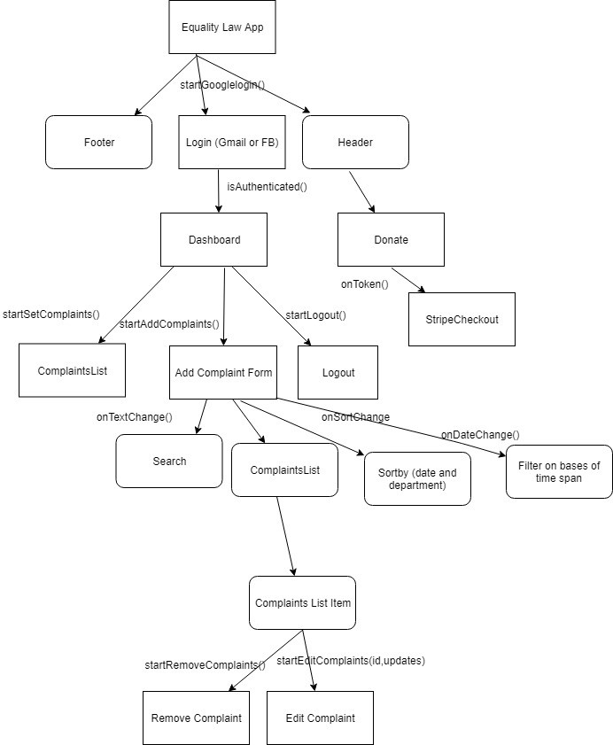

# Assignment 1 - ReactJS app.

Name: Bhawana Sharma

## Overview.
Harassment App: It�s a harassment or equality law app where user can lodge a complaint against any harassment that happened in their office either by co-workers or by another person.

 ##List of user features (excluding user registration and authentication)
  
Login using Gmail and Facebook account (integration with firebase)
Add Complaints
Delete Complaints
Edit Complaints
Dashboard which show the list of complaints filed
Search Complaints
Filter Complaints by time span
Sort by on the basis of date and department
Donate Us 
Help page with FAQ
About Us page
Contact Us page (Google Maps React)
Doughnut Chart
Loading Page
404 page
UI Validation
Logout

## Installation requirements.

I have used firebase Realtime database, firebase authentication and Redux to manage the dataflow.

## Data Model Design.

## UI Design.

##Data Flow-Redux

## Routing.
List each route supported and state the associated view  

+ / - Display Login page (main page of the website)
+ /dashboard-Display the list of complaints
+ /create- Display Add Complaint Form (Me too Form)
+ /edit/id- detail view of a particular complaints and either edit or remove the complaints(:id)
+ /donate-Display the donate page (Stripe API for payment)
+ /about-Display the vision, mission and goals
+ /help- Display FAQ's 
+ /contact-Display Google Map and Contact details
+ /404-Display Error when page not found

##Specify which, if any, of the above routes are protected (require login)
1.Dashboard Page
2.Edit Page
3.Add Complaints Page
4.Remove Complaints Page

## Extra features

1.Firebase Authentication
2.UI Validation (Add Complaints Form)
3.Data Validation using Firebase
4.Redux-to manage data flow
5.Header and Footer
6.Linking among pages
7.Responsive Web design
8.For re-rendering: Redux implemented in a just single store with action and reducers folder which manage the state of the component.
(view->Action->reducer(s)->store->view)  

## Independent learning.

Firebase Realtime Database, Firebase Authentication, Promises-based API (axios), Promises with Firebase, Stripe API for receive payment, Redux with React, Styling using MDB, React-dates with moment, Google Map React.

